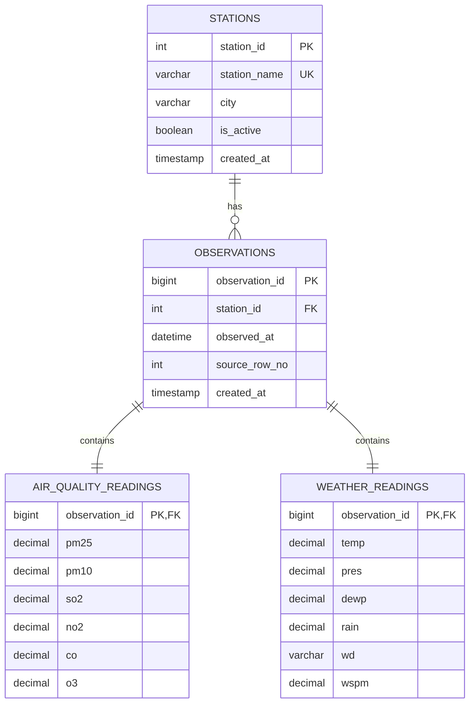

# Beijing Air Quality Database ERD

## Design Notes

- `stations` stores the 12 monitoring sites once.
- `observations` stores one hourly timestamp per station.
- `air_quality_readings` stores pollutant measurements.
- `weather_readings` stores meteorological measurements.
- `v_hourly_air_quality` in the schema joins everything back into a single API-friendly hourly record.

## Why This Design

- It avoids repeating station metadata across millions of rows.
- It enforces one reading per station per hour.
- It keeps pollutant and weather data separated but still directly joinable.
- It supports both analytical SQL and later REST API endpoints cleanly.
